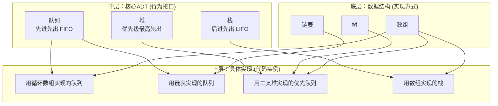

数据结构与队列、堆、栈的关系可以概括为：**数据结构是“容器”或“组织形式”的范畴，而队列、堆、栈是建立在特定数据结构之上的“行为规范”或“使用接口”**。

以下是清晰的关系梳理：

---

### **核心关系：容器 vs 协议**

---

### **详细解释**

#### **1. 数据结构 = “怎么做” (How)**
- **定义**：数据在内存中的**具体存储和组织方式**。
- **核心**：关心**物理实现细节**（内存如何分配、元素如何链接）。
- **例子**：
- **数组**：连续内存块，通过索引访问。
- **链表**：分散节点，通过指针链接。
- **树**：分层节点结构，有父子关系。

#### **2. 队列/堆/栈 = “做什么” (What)**
- **定义**：一组操作的**行为规范**，定义了**数据进出的顺序规则**。
- **核心**：关心**逻辑接口和规则**，不关心底层如何存储。
- **例子**：
- **队列 (FIFO)**：只允许在队尾添加，在队头移除。
- **栈 (LIFO)**：只允许在栈顶添加和移除。
- **堆/优先队列**：每次移除优先级最高的元素。

---

### **关键比喻**

| 概念 | 比喻 | 说明 |
|------|------|------|
| **数据结构** | **建筑材料**（砖块、钢筋） | 决定建筑的基础和物理特性 |
| **队列/堆/栈** | **建筑蓝图/功能规范**（走廊、仓库、电梯井） | 规定人/物的流动方向和规则 |
| **具体实现** | **建好的建筑**（用砖砌的走廊，用钢架的仓库） | 蓝图用具体材料实现的实体 |

**例子：**
- **“用数组实现一个栈”** = 用**砖块（数组）** 按照**电梯井蓝图（栈规则）** 砌了一个筒仓。
- **“用链表实现一个队列”** = 用**钢筋链接（链表）** 按照**排队走廊蓝图（队列规则）** 搭了一个通道。

---

### **关系层次表**

| 层次 | 名称 | 角色 | 例子 |
|------|------|------|------|
| **L3 应用层** | 具体实现 | 用某种数据结构实现特定ADT | `ArrayStack`, `LinkedListQueue` |
| **L2 逻辑层** | 抽象数据类型 | 定义数据操作的行为规则 | **栈、队列、堆** |
| **L1 物理层** | 数据结构 | 数据在内存中的存储方式 | **数组、链表、树** |

---

### **为什么这种分离很重要？**

1. **设计灵活性**：同一个栈可以用数组或链表实现，根据场景选择最优。
2. **概念清晰化**：将“行为”和“实现”解耦，便于理解和教学。
3. **代码复用**：实现一个数组后，可以用它实现栈、队列等多种ADT。

---

### **一句话总结**

**数据结构（如数组、链表）是“武器”**，而**队列、堆、栈是“战术动作”**。你可以用不同的武器（数据结构）来完成同一个战术动作（实现同一个ADT），关键在于动作的规范（FIFO/LIFO）不变，但武器的选择（数组/链表）会影响动作的效率。